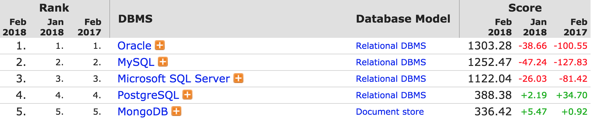

## Setup

_Note: this should have been done by participants before the start of the workshop._

We use [SQLite Manager](https://addons.mozilla.org/en-us/firefox/addon/sqlite-manager/)
and the 
[Portal Project dataset](https://figshare.com/articles/Portal_Project_Teaching_Database/1314459)
throughout this lesson. See [Setup](/sql-ecology-lesson/setup/) for
instructions on how to download the data, and also how to install and open
SQLite Manager.

## What is SQL?

SQL stands for Structured Query Language. SQL allows us to interact with relational databases through queries. 
These queries can allow you to perform a number of actions such as: insert, update and delete information in a database.

## Dataset Description

The data we will be using soda sells data. It contains invoice information about soda purchase from soda makers (vendors) by retail stores. 
The data was originated from a real dataset. We have modofied the dataset for this workshop. For example, soda names are completely fictitious, and price was also normalized.   

## Questions

> ## Think about this situation
>
> Imagine if you are a owner of a convenience store, and you are trying to record your soda purchase record  
> In each invoice, it contains the following infortaion:  
> Invoice id, Date, Category, Soda name, Volume, Cost, Retail Price, Vendor, Number of bottle purchased  
> How would you store the data?  
{: .challenge}

## Traditional File Approach 
If you store all these invoice information in one Excel file, 
What problem could raise from this approach?  
<b>Data redundency:</b>  

Imagine if you consistantly purchased some Big Dog Cola from LCDM Beverage vendor every day for 5 days, 
Notice these columns: Category, Soda_name, Volume, Cost, Retail_Price, Vendor, Vendor number
With tranditional file approach, you have to record exact same information in these columns 5 times.  
<b>Data inconsistancy:</b>  

Imagine if the vendor changed its phone number. Then multiple changes has to be made. 
There are only 5 rows so it might be easy to change everything. If the data size gets large, mistakes are likely to occur.  

If you thought about storing these information in few different Excel files, <b>great idea! You are on the right track </b> 
However, if you want information from all files at the same time, how do you combine them? If each file contains thoudans of rows, Ah...  
{:height="100px" width="100px"}

## Goals

To sum up, these are frequent used data operations: 

* select subsets of the data (rows and columns)
* group subsets of data
* do math and other calculations
* combine data across spreadsheets

In addition, we don't want to do this manually!  Instead of searching 
for the right pieces of data ourselves, or clicking between spreadsheets, 
or manually sorting columns, we want to make the computer do the work.  

In particular, we want to use a tool where it's easy to repeat our analysis 
in case our data changes. We also want to do all this searching without 
actually modifying our source data.  

Putting our data into a <b>relational database</b> and using SQL will help us achieve these goals.  

> ## Definition: *Relational Database*
>
> A relational database stores data in *relations* made up of *records* with *fields*.
> The relations are usually represented as *tables*;
> each record is usually shown as a row, and the fields as columns.
> In most cases, each record will have a unique identifier, called a *key*,
> which is stored as one of its fields.
> Records may also contain keys that refer to records in other tables,
> which enables us to combine information from two or more sources.
{: .callout}

# Databases

## Why use relational databases

Using a relational database serves several purposes.

* It keeps your data separate from your analysis.
    * This means there's no risk of accidentally changing data when you analyze it.
    * If we get new data we can just rerun the query.
* It's fast, even for large amounts of data.
* It improves quality control of data entry (type constraints and use of forms in MS Access, Filemaker, Oracle Application Express etc.)
* The concepts of relational database querying are core to understanding how to do similar things using programming languages such as R or Python.

## Database Management Systems (DBMS)

There are a number of different database management systems for working with
relational data. We're going to use SQLite today, but basically everything we
teach you will apply to the other database systems as well (e.g. MySQL,
PostgreSQL, MS Access, MS SQL Server, Oracle Database and Filemaker Pro). The 
only things that will differ are the details of exactly how to import and 
export data and the [details of data types](#datatypediffs).

Look at the [popularity of database](https://db-engines.com/en/ranking)  
{:height="170px"}  
Top 4 are all Relational Database Management Systems (RDBMS). More and more companies choose to use relational database. 

## Relational databases

Let's look at a pre-existing database, the `soda.db`
file that we downloaded during
[Setup](/sql-business/setup/). Clicking on the "open file" icon, then
find that file and clicking on it will open the database.

You can see the tables in the database by looking at the left hand side of the
screen under Tables, where each table corresponds to one of the `csv` files 
we were exploring earlier.  To see the contents of any table, click on it, and
then click the “Browse and Search” tab in the right panel.  This will 
give us a view that we're used to - just a copy of the table.  Hopefully this 
helps to show that a database is, in some sense, just a collection of tables, 
where there's some value in the tables that allows them to be connected to each 
other (the "related" part of "relational database").  

The leftmost tab, "Structure", provides some metadata about each table.  It 
describes the columns, often called *fields*. (The rows of a database table 
are called *records*.)  If you scroll down in the Structure view, you'll 
see a list of fields, their labels, and their data *type*.  Each field contains 
one variety or type of data, often numbers or text.  You can see in the 
`surveys` table that most fields contain numbers (integers) while the `species` 
table is nearly all text.  

The "Execute SQL" tab is blank now - this is where we'll be typing our queries 
to retrieve information from the database tables.  

To summarize: 

* Relational databases store data in tables with fields (columns) and records
  (rows)
* Data in tables has types, and all values in a field have
  the same type ([list of data types](#datatypes))
* Queries let us look up data or make calculations based on columns

## Database Design

* Every row-column combination contains a single *atomic* value, i.e., not
   containing parts we might want to work with separately.
* One field per type of information
* No redundant information
    * Split into separate tables with one table per class of information
    * Needs an identifier in common between tables – shared column - to
       reconnect (known as a *foreign key*).

## Import

Before we get started with writing our own queries, we'll load the data into the database. 
We'll need the following file: 
* `soda.db`
Here are all the attributes in the database:  

| Attributes          | Data Type      | Description                                                | Table(s)                  |
|---------------------|:---------------|------------------------------------------------------------|---------------------------|
| County_id           | INTEGER        | Unique id for each county                                  | county, store_info        |
| County_Name         | TEXT           | Name of county                                             | county                    |
| City_Name           | TEXT           | Name of the city that the county is in                     | county                    |
| Category_id         | VARCHAR(20)    | Unique id for each category                                | category, item_info       |
| Category_Name       | TEXT           | Name of the category	    						        | category                  |
| Vendor_id           | INTEGER        | Unique id for each vendor                                  | vendor, invoice_info      |
| Vendor_Name         | TEXT           | Name of the vendor 							            | vendor                    |
| Store_id            | INTEGER        | Unique id for each store                                   | store_info, invoice_info  |
| Store_Name          | TEXT           | Name of the store								            | store_indo                |
| Address             | TEXT           | Address of the store                                   	| store_info                |
| Zip_Code            | INTEGER        | Zip code of the store                            	        | store_info                |
| Item_id             | INTEGER        | Unique id for each item (soda)                             | item_info, invoice_id     |
| Item_Description    | TEXT           | Name of the item (soda)                                    | item_info                 |
| Pack                | INTEGER        | Number of bottles that the soda usually sells for          | item_info                 |
| Bottle_Volume_ml    | DOUBLE         | Volumn of the soda in ml                                   | item_info                 |
| Bottle_Cost         | DOUBLE         | Cost of one bottle                                         | item_info                 |
| Bottle_Retail_Price | DOUBLE         | Retile price for one bottle                                | item_info                 |
| Invoice_id          | VARCHAR(20)    | Unique id for each invoice                                 | invoice_info              |
| Date                | TEXT           | Date of the invoice                                        | invoice_info              |
| Bottle_Sold         | INTEGER        | Number of bottle sold in the invoice                       | invoice_info              |

Finally, click **OK** one more time to confirm the operation.

> ## Challenge
>
> - Import the `plots` and `species` tables
{: .challenge}

You can also use this same approach to append new data to an existing table.

## Adding data to existing tables

1. "Browse and Search" tab -> Add
1. Enter data into a csv file and append

##  Data types

| Data type                          | Description                                                                                              |
|------------------------------------|:---------------------------------------------------------------------------------------------------------|
| CHARACTER(n)                       | Character string. Fixed-length n                                                                         |
| VARCHAR(n) or CHARACTER VARYING(n) | Character string. Variable length. Maximum length n                                                      |
| BINARY(n)                          | Binary string. Fixed-length n                                                                            |
| BOOLEAN                            | Stores TRUE or FALSE values                                                                              |
| VARBINARY(n) or BINARY VARYING(n)  | Binary string. Variable length. Maximum length n                                                         |
| INTEGER(p)                         | Integer numerical (no decimal).                                                                          |
| SMALLINT                           | Integer numerical (no decimal).                                                                          |
| INTEGER                            | Integer numerical (no decimal).                                                                          |
| BIGINT                             | Integer numerical (no decimal).                                                                          |
| DECIMAL(p,s)                       | Exact numerical, precision p, scale s.                                                                   |
| NUMERIC(p,s)                       | Exact numerical, precision p, scale s. (Same as DECIMAL)                                                 |
| FLOAT(p)                           | Approximate numerical, mantissa precision p. A floating number in base 10 exponential notation.          |
| REAL                               | Approximate numerical                                                                                    |
| FLOAT                              | Approximate numerical                                                                                    |
| DOUBLE                             | Approximate numerical                                                                                    |
| DATE*                              | Stores year, month, and day values                                                                       |
| TIME*                              | Stores hour, minute, and second values                                                                   |
| TIMESTAMP*                         | Stores year, month, day, hour, minute, and second values                                                 |
| INTERVAL                           | Composed of a number of integer fields, representing a period of time, depending on the type of interval |
| ARRAY                              | A set-length and ordered collection of elements                                                          |
| MULTISET                           | A variable-length and unordered collection of elements                                                   |
| XML                                | Stores XML data                                                                                          |

*SQLite does not have a separate storage class for storing dates and/or times, but SQLite is capable of storing dates and times as TEXT, REAL or INTEGER values. In the database we used today, the date attribute is stored as text in "YYYY-MM-DD" format. 

##  SQL Data Type Quick Reference

Different databases offer different choices for the data type definition.

The following table shows some of the common names of data types between the various database platforms:

| Data type                                               | Access                    | SQLServer            | Oracle             | MySQL          | PostgreSQL    |
|:--------------------------------------------------------|:--------------------------|:---------------------|:-------------------|:---------------|:--------------|
| boolean                                                 | Yes/No                    | Bit                  | Byte               | N/A            | Boolean       |
| integer                                                 | Number (integer)          | Int                  | Number             | Int / Integer  | Int / Integer |
| float                                                   | Number (single)           | Float / Real         | Number             | Float          | Numeric       |
| currency                                                | Currency                  | Money                | N/A                | N/A            | Money         |
| string (fixed)                                          | N/A                       | Char                 | Char               | Char           | Char          |
| string (variable)                                       | Text (<256) / Memo (65k+) | Varchar              | Varchar2 | Varchar        | Varchar       |
| binary object	OLE Object Memo	Binary (fixed up to 8K)   | Varbinary (<8K)           | Image (<2GB)	Long | Raw	Blob          | Text	Binary | Varbinary     |
