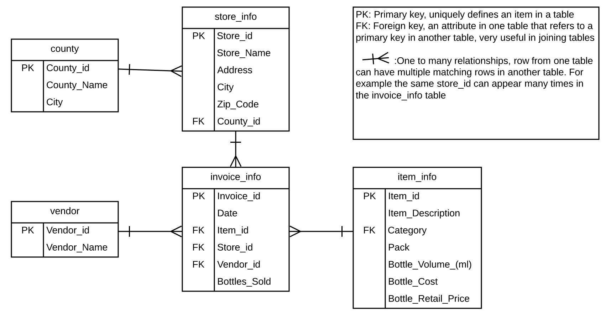

## Setup

_Note: this should have been done by participants before the start of the workshop._

See [Setup](../setup/) for
instructions on how to download the data, and also how to install and open SQLite Manager.

## Import

Before we get started with writing our own queries, we'll load the data into the database. 
We'll need the following file: 
* `soda.db` <br>

## Dataset Description

The data we will be using soda sells data. It contains invoice information about soda purchase from soda makers (vendors) by retail stores. 
The data was originated from a real dataset. We have modofied the dataset for this workshop. For example, soda names are completely fictitious, and price was also normalized.  

1. In an jupyter notebook cell, put in the following code to import sqlite3 and pandas modules:  
```
import sqlite3 as sql
import pandas as pd
```

`sqlite3` will be included within a standard Python installation.  `pandas` is not part of the [Python Standard Library](https://docs.python.org/3/library/index.html), but will normally be bundled with Anaconda.

2. in the next cell, create a connection to the database called conn  
```
conn = sql.connect('soda.db')
```
3. In the next cell, write your query as string called "q" (you can call it whatever you want). The follwing example is to select everything in a table called item:  
```
q = '''
SELECT * FROM item_info;
'''
```
4.  The pandas package in Python has a built in function to [read sql](http://pandas.pydata.org/pandas-docs/version/0.20/generated/pandas.read_sql.html).
The following code will execute the query and assign the result to a DataFrame variable called "df", and show the result (use .head(10) to show first 10 result, you can remove that part to show the full result): 
```
df = pd.read_sql(q, conn)
df.head(10)
``` 
5. To run a diffierent query, you can just change the query string between `''' '''` and run the code above again.  

You just ran your first SQL query! Now, lets see what's in the database 

Here are all the attributes in the database:  

| Attributes          | Data Type      | Description                                                | Table(s)                  |
|---------------------|:---------------|------------------------------------------------------------|---------------------------|
| County_id           | INTEGER        | Unique id for each county                                  | county, store_info        |
| County_Name         | TEXT           | Name of county                                             | county                    |
| City_Name           | TEXT           | Name of the city that the county is in                     | county                    |
| Category            | VARCHAR(20)    | Category of soda                                           | item_info                 |
| Vendor_id           | INTEGER        | Unique id for each vendor                                  | vendor, invoice_info      |
| Vendor_Name         | TEXT           | Name of the vendor 							            | vendor                    |
| Store_id            | INTEGER        | Unique id for each store                                   | store_info, invoice_info  |
| Store_Name          | TEXT           | Name of the store								            | store_indo                |
| Address             | TEXT           | Address of the store                                   	| store_info                |
| Zip_Code            | INTEGER        | Zip code of the store                            	        | store_info                |
| Item_id             | INTEGER        | Unique id for each item (soda)                             | item_info, invoice_id     |
| Item_Description    | TEXT           | Name of the item (soda)                                    | item_info                 |
| Pack                | INTEGER        | Number of bottles that the soda usually sells for          | item_info                 |
| Bottle_Volume_ml    | DOUBLE         | Volumn of the soda in ml                                   | item_info                 |
| Bottle_Cost         | DOUBLE         | Cost of one bottle                                         | item_info                 |
| Bottle_Retail_Price | DOUBLE         | Retile price for one bottle                                | item_info                 |
| Invoice_id          | VARCHAR(20)    | Unique id for each invoice                                 | invoice_info              |
| Date                | TEXT           | Date of the invoice                                        | invoice_info              |
| Bottle_Sold         | INTEGER        | Number of bottle sold in the invoice                       | invoice_info              |

To have a better understanding of Primary keys and Foreign keys discussed in previous session, lets look at the tables and their relationships:  
{:height="500px"}

## <a name="datatypes"></a> Data types

Common SQL datatypes: 

| Data type                          | Description                                                                                              |
|------------------------------------|:---------------------------------------------------------------------------------------------------------|
| CHARACTER(n)                       | Character string. Fixed-length n                                                                         |
| VARCHAR(n) or CHARACTER VARYING(n) | Character string. Variable length. Maximum length n                                                      |
| BINARY(n)                          | Binary string. Fixed-length n                                                                            |
| BOOLEAN                            | Stores TRUE or FALSE values                                                                              |
| VARBINARY(n) or BINARY VARYING(n)  | Binary string. Variable length. Maximum length n                                                         |
| INTEGER(p)                         | Integer numerical (no decimal).                                                                          |
| SMALLINT                           | Integer numerical (no decimal).                                                                          |
| INTEGER                            | Integer numerical (no decimal).                                                                          |
| BIGINT                             | Integer numerical (no decimal).                                                                          |
| DECIMAL(p,s)                       | Exact numerical, precision p, scale s.                                                                   |
| NUMERIC(p,s)                       | Exact numerical, precision p, scale s. (Same as DECIMAL)                                                 |
| FLOAT(p)                           | Approximate numerical, mantissa precision p. A floating number in base 10 exponential notation.          |
| REAL                               | Approximate numerical                                                                                    |
| FLOAT                              | Approximate numerical                                                                                    |
| DOUBLE                             | Approximate numerical                                                                                    |
| DATE*                              | Stores year, month, and day values                                                                       |
| TIME*                              | Stores hour, minute, and second values                                                                   |
| TIMESTAMP*                         | Stores year, month, day, hour, minute, and second values                                                 |
| INTERVAL                           | Composed of a number of integer fields, representing a period of time, depending on the type of interval |
| ARRAY                              | A set-length and ordered collection of elements                                                          |
| MULTISET                           | A variable-length and unordered collection of elements                                                   |
| XML                                | Stores XML data                                                                                          |

*SQLite does not have a separate storage class for storing dates and/or times, but SQLite is capable of storing dates and times as TEXT, REAL or INTEGER values. In the database we used today, the date attribute is stored as text in "YYYY-MM-DD" format. 

## <a name="datatypediffs"></a> SQL Data Type Quick Reference

Different databases offer different choices for the data type definition.

The following table shows some of the common names of data types between the various database platforms:

| Data type                                               | Access                    | SQLServer            | Oracle             | MySQL          | PostgreSQL    |
|:--------------------------------------------------------|:--------------------------|:---------------------|:-------------------|:---------------|:--------------|
| boolean                                                 | Yes/No                    | Bit                  | Byte               | N/A            | Boolean       |
| integer                                                 | Number (integer)          | Int                  | Number             | Int / Integer  | Int / Integer |
| float                                                   | Number (single)           | Float / Real         | Number             | Float          | Numeric       |
| currency                                                | Currency                  | Money                | N/A                | N/A            | Money         |
| string (fixed)                                          | N/A                       | Char                 | Char               | Char           | Char          |
| string (variable)                                       | Text (<256) / Memo (65k+) | Varchar              | Varchar2 | Varchar        | Varchar       |
| binary object	OLE Object Memo	Binary (fixed up to 8K)   | Varbinary (<8K)           | Image (<2GB)	Long | Raw	Blob          | Text	Binary | Varbinary     |
